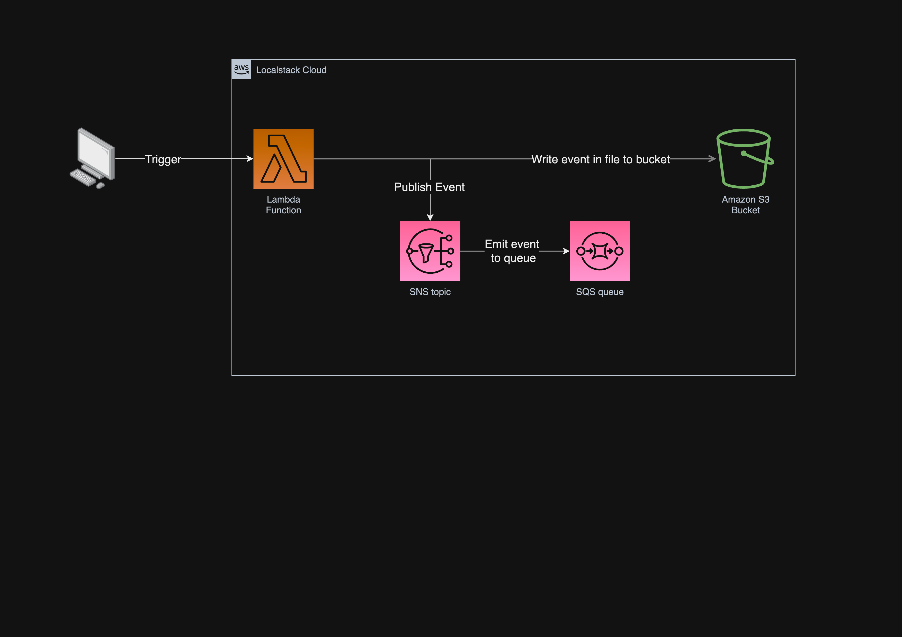

## Localstack - AWS in your hand on your machine!

This sample shows you how to set up a local cost free AWS environment! You will be able to use almost every AWS service on your local machine, without any costs. This is a great way to test your applications locally before you deploy them to the cloud. S3, SQS, SNS, Lambda, DynamoDB, ... are just a few of the services you can use with localstack. 

Check out the [localstack website](https://localstack.cloud/) and their [GitHub repository](https://github.com/localstack/localstack)

Benefits of Localstack:
- fully localized and isolated aws environment
- less money spent on aws resources
- testing serverless is easy
- easy to try things and play with aws cli

[Link to the YouTube video](https://youtu.be/XPFl28a0mrQ)

## Localstack

Project structure:
```
.
├── README.md
├── docker-compose.yml
├── init-aws.sh
├── lambda
│   ├── lambda.py
│   └── requirements.txt
├── resources
│   └── architecture.drawio.png
└── terraform
    └── provision.tf
```

### Prerequisites:
- [Docker](https://www.docker.com/)
- [aws-cli](https://aws.amazon.com/cli/)
- [awslocal](https://docs.localstack.cloud/user-guide/integrations/aws-cli/)
- [Python](https://python.org)


[_docker-compose.yml_](docker-compose.yml)
```
version: "3.8"

services:
  localstack:
    container_name: "localstack"
    image: localstack/localstack:latest
    ports:
      - "127.0.0.1:4566:4566"            # LocalStack Gateway
      - "127.0.0.1:4510-4559:4510-4559"  # external services port range
    environment:
      - DEBUG=1
      - DOCKER_HOST=unix:///var/run/docker.sock
    volumes:
      - "/var/run/docker.sock:/var/run/docker.sock"
      - "./init-aws.sh:/etc/localstack/init/ready.d/init-aws.sh" #chmod +x init-aws.sh
```
The compose file defines localstack and mounts a [provisioning file](./init-aws.sh) into the init process. Debug mode is turned on for better log output. 

[_init-aws.sh_](./init-aws.sh)

Creates some infrastructure in the localstack environment. This is not necessary, but it is a good way to start with localstack. You can also create the infrastructure manually with the aws cli.

Make sure the file is executable: `chmod +x init-aws.sh` 
```bash
#!/bin/bash
echo "Create SQS queue"
awslocal sqs create-queue --queue-name my-queue
echo "Create SNS Topic testTopic"
awslocal sns create-topic --name my-topic
echo "Subscribe testQueue to testTopic"
awslocal sns subscribe --topic-arn arn:aws:sns:us-east-1:000000000000:my-topic --protocol sqs --notification-endpoint arn:aws:sqs:us-east-1:000000000000:my-queue
echo "Create S3 bucket"
awslocal s3api create-bucket --bucket my-bucket
```

Useful command list starting from the folder `./localstack` in order to deploy a lambda function, and interact with the local aws cloud:
<details>
<summary>Click to expand</summary>

```bash
# Install a virtual Python environment
python -m venv venv

# Activate the Python environment in your current shell
source venv/bin/activate

# Install requirements (boto3) in the lambda folder
pip install -r lambda/requirements.txt --target lambda

# Change into the lambda folder
cd lambda

# Create a zip file with all the files from the `lambda` folder
zip -r ../deploy-package.zip .

# Go back to the previous directory
cd -

# Create a function using the created zip file
awslocal lambda create-function --function-name my-function --runtime python3.10 --zip-file fileb://deploy-package.zip --handler lambda.lambda_handler --environment Variables={ENVIRONMENT=local} --role arn:aws:iam::000000000000:role/service-role/MyTestFunction-role

# Check the provisioning state of the lambda function
awslocal lambda get-function --function-name my-function

# Create a topic
awslocal sns create-topic --name my-topic

# Create a bucket
awslocal s3api create-bucket --bucket my-bucket

# Check the `my-bucket` for files
awslocal s3 ls s3://my-bucket --recursive --human-readable --summarize

# Check the health status of localstack
curl http://localhost:4566/health | jq

# Receive messages from the queue
awslocal sqs receive-message --queue-url http://localhost:4566/000000000000/my-queue | jq

# Create a copy of the object
awslocal s3 cp s3://my-bucket/my-object.txt s3://my-bucket/my-object-copy.txt

# See the bucket
curl http://s3.localhost:4566/my-bucket

# Get the object
curl http://s3.localhost:4566/my-bucket/my-object.txt

```
</details>


After creating and interacting with the infrastructure you can check the Dashboard of Localstack in the browser at https://app.localstack.cloud/status.

You have to create an account, and link to your localstack instance in the settings. (In my case: http://localhost:4566)

### Architecture diagram of the localstack environment:


## Bonus: Localstack with Terraform
Prerequisites:
- [Terraform](https://www.terraform.io/)
- Some extra aws provider configuration:
  - [_provision.tf_](./terraform/provision.tf)
  ```terraform
  ...
  access_key = "test"
  secret_key = "test"

  # only required for non virtual hosted-style endpoint use case.
  # https://registry.terraform.io/providers/hashicorp/aws/latest/docs#s3_use_path_style
  s3_use_path_style           = true
  skip_credentials_validation = true
  skip_metadata_api_check     = true
  skip_requesting_account_id  = true

  endpoints {
    s3  = "http://localhost:4566"
    sns = "http://localhost:4566"
    sqs = "http://localhost:4566"
  }
  ...
  ```

simply run `terraform init` and `terraform apply` in the [terraform folder](./terraform) to create the infrastructure in localstack.
